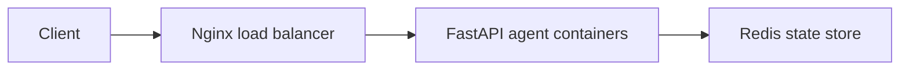

# Day 12 Lab - Mission Answers

## Part 1: Localhost vs Production

### Exercise 1.1: Anti-patterns found

1. API keys and database credentials are hardcoded directly in `develop/app.py`.
2. Debug mode and model settings are hardcoded instead of being read from environment variables.
3. The app logs sensitive values with `print`, including the API key.
4. There is no `/health` or `/ready` endpoint for deployment platforms to monitor.
5. The app binds to `localhost`, so it cannot receive traffic from outside a container.
6. The port is fixed at `8000` instead of using the platform-provided `PORT` variable.
7. `reload=True` is enabled, which is useful for development but unsafe for production.
8. There is no graceful shutdown flow for container stop or platform restart events.

### Exercise 1.3: Comparison table

| Feature | Develop | Production | Why Important? |
|---|---|---|---|
| Config | Values are hardcoded in code | Values come from environment variables | The same image can run in local, staging, and production without code changes. |
| Secrets | API key and DB password are in source code | Secrets are injected at runtime | Prevents secrets from leaking through GitHub or logs. |
| Host/port | `localhost:8000` | `0.0.0.0` and `PORT` env var | Containers and cloud platforms need external binding and dynamic ports. |
| Health check | Missing | `/health` returns status, version, uptime | Platforms can restart unhealthy containers. |
| Readiness check | Missing | `/ready` reports whether the app can receive traffic | Load balancers avoid routing requests during startup or shutdown. |
| Logging | `print()` and secret values | Structured JSON logs with non-sensitive metadata | Production logs can be searched and parsed safely. |
| Shutdown | No signal handling | Lifespan shutdown and SIGTERM logging | Requests and connections can finish cleanly during deploys. |
| Debug mode | Always reloads | Reload only when `DEBUG=true` | Avoids development behavior and extra processes in production. |

## Part 2: Docker

### Exercise 2.1: Dockerfile questions

1. Base image: the basic Dockerfile uses `python:3.11`.
2. Working directory: `/app`.
3. `COPY requirements.txt` happens before copying application code so Docker can cache dependency installation when only source files change.
4. `CMD` provides the default command for the container and can be overridden at run time. `ENTRYPOINT` defines the main executable and is usually harder to replace unless explicitly overridden.

### Exercise 2.3: Multi-stage build

- Stage 1 is the builder stage. It installs build tools and Python dependencies into `/root/.local`.
- Stage 2 is the runtime stage. It copies only installed packages and application files, then runs as a non-root user.
- The image is smaller because compiler/build packages and intermediate files do not ship in the final runtime image.
- Develop/final local image size: `day12-agent:local` = 247 MB.
- Production compose image size: `06-lab-complete-agent:latest` = 307 MB.
- Requirement result: production image is below the 500 MB target.

### Exercise 2.4: Docker Compose architecture



Services started by the final compose file:

- `nginx`: exposes the app at `http://localhost:8080` and forwards traffic to the agent service.
- `agent`: runs the FastAPI production agent image.
- `redis`: stores conversation history, rate-limit windows, and monthly budget counters.

## Part 3: Cloud Deployment

### Exercise 3.1: Railway deployment

- URL: pending Railway login and `railway up` from the student's account.
- Local verified URL: `http://localhost:8080` after `docker compose up -d --build`.
- Screenshot: pending cloud deployment dashboard screenshot.

### Exercise 3.2: Railway vs Render config

| Item | Railway | Render |
|---|---|---|
| Config file | `railway.toml` | `render.yaml` |
| Build mode | Dockerfile builder | Docker runtime service |
| Health check | `healthcheckPath = "/health"` | `healthCheckPath: /health` |
| Environment variables | Set through Railway CLI or dashboard | Declared as blueprint entries, with secrets generated or synced manually |
| Redis | Add as a Railway service and set `REDIS_URL` | Declared as a Redis service and linked to the web app with `fromService` |
| Best fit | Fast prototype deploys | GitHub-connected blueprint deploys |

### Exercise 3.3: Cloud Run notes

`cloudbuild.yaml` builds and pushes the container image. `service.yaml` defines how Cloud Run starts the service, injects environment variables, routes traffic, and checks service health.

## Part 4: API Security

### Exercise 4.1: API key authentication

The API key is checked in `app/auth.py` by reading the `X-API-Key` header and comparing it with `AGENT_API_KEY`.

Expected local test results:

```bash
curl -X POST http://localhost:8080/ask \
  -H "Content-Type: application/json" \
  -d "{\"user_id\":\"test\",\"question\":\"Hello\"}"
# 401 Unauthorized
```

```bash
curl -X POST http://localhost:8080/ask \
  -H "X-API-Key: dev-key-change-me-in-production" \
  -H "Content-Type: application/json" \
  -d "{\"user_id\":\"test\",\"question\":\"Hello\"}"
# 200 OK with a mock agent answer
```

Actual Docker verification:

- No API key: `401`
- With API key: `200`, returned mock Docker answer
- Health check: `200`, Redis status `ok`
- Readiness check: `200`, Redis status `ok`

### Exercise 4.2: JWT authentication

The advanced example in `04-api-gateway/production/auth.py` creates JWTs with username, role, issued-at, and expiry fields. Each protected request sends `Authorization: Bearer <token>`, then the server verifies the token signature and expiry before allowing access.

### Exercise 4.3: Rate limiting

- Algorithm: Redis-backed sliding window using a sorted set per user.
- Limit: 10 requests per minute per `user_id`.
- Admin bypass: in the advanced JWT example, admins use a separate limiter with a higher limit. In the final API-key project, all users share the configured `RATE_LIMIT_PER_MINUTE`.

Expected local test result:

```bash
for i in 1 2 3 4 5 6 7 8 9 10 11; do
  curl -s -o /dev/null -w "%{http_code}\n" \
    -X POST http://localhost:8080/ask \
    -H "X-API-Key: dev-key-change-me-in-production" \
    -H "Content-Type: application/json" \
    -d "{\"user_id\":\"rate-test\",\"question\":\"Test $i\"}"
done
# First 10 calls: 200
# 11th call: 429
```

Actual Docker result: `200,200,200,200,200,200,200,200,200,200,429`.

### Exercise 4.4: Cost guard implementation

The final app implements the cost guard in `06-lab-complete/app/cost_guard.py`.

Approach:

- Estimate cost from input and output token counts.
- Store monthly spend in Redis key `budget:<user_id>:<YYYY-MM>`.
- Set a 32-day TTL so old monthly counters expire automatically.
- Reject requests with HTTP 402 if the projected monthly spend exceeds `$10`.
- Store token counters separately in Redis hash `budget:<user_id>:<YYYY-MM>:tokens`.

## Part 5: Scaling & Reliability

### Exercise 5.1: Health checks

The final app exposes:

- `GET /health`: returns liveness, app version, environment, uptime, request count, LLM mode, and Redis status.
- `GET /ready`: returns 200 only when app startup has completed and Redis responds to `PING`; otherwise it returns 503.

### Exercise 5.2: Graceful shutdown

The app uses FastAPI lifespan events and a SIGTERM handler. Uvicorn is started with `timeout_graceful_shutdown=30`, giving in-flight requests time to complete during container stop or deploy replacement.

### Exercise 5.3: Stateless design

The final app stores state in Redis instead of process memory:

- Conversation history: `history:<user_id>`
- Rate windows: `rate:<user_id>`
- Monthly cost counters: `budget:<user_id>:<YYYY-MM>`

This allows multiple agent containers to serve the same user without losing history or bypassing limits.

### Exercise 5.4: Load balancing

The final compose stack includes Nginx. Requests go through `http://localhost:8080`, then Nginx forwards to the `agent` service. The app can be scaled with:

```bash
docker compose up --scale agent=3
```

### Exercise 5.5: Test stateless

The stateless behavior is covered by Redis-backed conversation history and verified by calling `/ask` multiple times with the same `user_id`, then checking `/history/<user_id>`.

## Part 6: Final Project

Final source code is in `06-lab-complete/`.

Implemented:

- REST API agent endpoint: `POST /ask`
- Conversation history in Redis
- Multi-stage Dockerfile
- Environment-based configuration
- API key authentication
- Redis-backed rate limiting at 10 requests/minute
- Redis-backed monthly cost guard at `$10/user/month`
- Health and readiness checks
- Graceful shutdown handling
- Stateless design with Redis
- Structured JSON request logging
- Railway and Render deployment configuration

Docker verification result:

- `docker build -t day12-agent:local .`: passed
- `docker compose up -d --build`: passed
- Running containers: `agent` healthy, `redis` healthy, `nginx` exposed on `localhost:8080`
- Production readiness checker: `20/20`
- Contract tests: `4/4`
