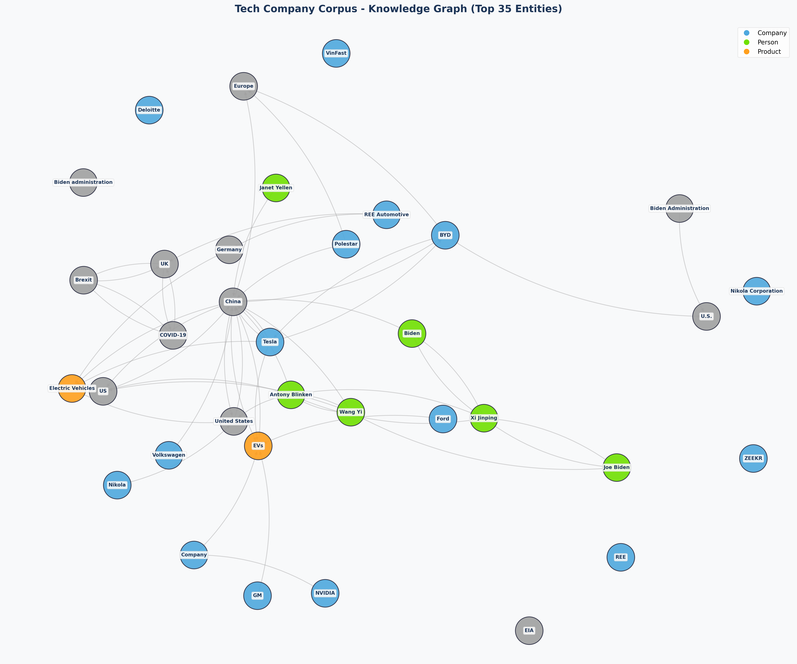

# Báo Cáo Kết Quả Lab Day 19: Xây Dựng Hệ Thống GraphRAG với Tech Company Corpus

Báo cáo chi tiết kết quả thực hiện bài lab xây dựng, truy vấn và đánh giá hệ thống GraphRAG so với hệ thống Flat RAG truyền thống.

---

## 1. Trả Lời Câu Hỏi Nghiên Cứu (Phần 1: Research)

### 2.1. Quy trình xử lý dữ liệu đồ thị - Trả lời câu hỏi nghiên cứu

1. **Entity Extraction: Làm sao để LLM phân biệt được đâu là thực thể (Node) và đâu là thuộc tính?**
   - **Cơ chế hoạt động:** LLM dựa vào ngữ cảnh và cú pháp ngữ nghĩa của câu để xác định. 
     - **Thực thể (Node):** Là các danh từ riêng, thực thể cụ thể (Proper Nouns) đại diện cho đối tượng tồn tại độc lập có thể định danh rõ ràng như Tên công ty (e.g. *OpenAI*, *Tesla*), Tên người (e.g. *Sam Altman*), Sản phẩm (*Chevy Bolt*), hoặc các khái niệm lớn (e.g. *Inflation Reduction Act*).
     - **Thuộc tính (Attribute):** Là các thông tin bổ nghĩa, mô tả hoặc các giá trị cụ thể gắn liền với thực thể (như *năm thành lập: 2015*, *doanh thu Q1 2024: $1.8B*, *địa chỉ trụ sở*). 
     - **Phân biệt bằng prompt:** Khi cấu trúc Prompt, chúng ta hướng dẫn LLM phân tách rõ: Node phải là danh từ độc lập đại diện cho thực thể (dùng làm Subject/Object trong đồ thị), còn các thông tin mang tính chất đo lường, mô tả, trị số sẽ được cấu trúc thành các Cạnh/Quan hệ (Relationship) hoặc được nhét vào trường mô tả thuộc tính (`description`) của Node đó thay vị tạo Node mới riêng lẻ, giúp giữ đồ thị gọn gàng và có tính kết nối cao.

2. **Graph Construction: Tại sao việc khử trùng lặp (Deduplication) lại quan trọng trong đồ thị?**
   - **Tầm quan trọng:** Trong đồ thị tri thức, sức mạnh cốt lõi nằm ở sự liên kết (Connectivity). Nếu không có khử trùng lặp:
     - Các biến thể viết tắt hoặc lỗi chính tả (e.g. "OpenAI Inc.", "OpenAI", "openai", "Open AI") sẽ tạo ra các node khác nhau.
     - Điều này làm **phân mảnh đồ thị (graph fragmentation)**, các mối quan hệ của cùng một thực thể thực tế sẽ bị chia rẽ ra các node ảo khác nhau, khiến giải thuật duyệt đồ thị (Graph Traversal) hoặc tìm kiếm đa bước (Multi-hop Querying) bị đứt gãy kết nối và không tìm thấy thông tin đầy đủ.
     - **Deduplication** giúp gộp toàn bộ thông tin mô tả và các quan hệ về một node duy nhất ("nhất thể hóa"), tối ưu hóa khả năng truy vấn đa bước chính xác.

3. **Query Answering: Sự khác biệt giữa duyệt đồ thị theo chiều rộng (BFS) và tìm kiếm vector thông thường là gì?**
   - **Tìm kiếm vector thông thường (Flat Search):** Chuyển câu hỏi thành vector, so sánh độ tương đồng cosine với các chunk trong cơ sở dữ liệu để tìm ra top-K chunk tương đồng nhất. Nó hoạt động độc lập trên từng đoạn text riêng lẻ, không có khái niệm về liên kết. Do đó, nếu thông tin nằm ở hai văn bản hoàn toàn khác nhau nhưng có liên hệ logic (e.g. "CEO của OpenAI co-founded công ty nào khác?"), tìm kiếm vector sẽ khó kéo đúng cả hai mảnh nếu từ khóa không trùng khít trực tiếp.
   - **Duyệt đồ thị (BFS / Hop Traversal):** Từ thực thể chính được xác định trong câu hỏi (Node xuất phát), giải thuật duyệt theo các cạnh liên kết lân cận (ví dụ 1-hop, 2-hop) để lấy ra tất cả thực thể liên quan mà không phụ thuộc vào độ tương đồng ngữ nghĩa của toàn bộ đoạn text. Nó cho phép **truy vết và kết nối cấu trúc mối quan hệ đa bước (Multi-hop Reasoning)** một cách tường minh, giúp tổng hợp thông tin phân tán trong toàn bộ corpus cực kỳ hiệu quả mà Flat RAG không thể làm được.

---

## 2. Trực Quan Hóa Đồ Thị Tri Thức Đã Xây Dựng

Đồ thị tri thức đã được xây dựng thành công bằng thư viện `NetworkX` và trực quan hóa qua `Matplotlib`.

*Hình 1: Đồ thị mô tả mối quan hệ giữa 35 thực thể có độ kết nối cao nhất trong Corpus.*

---

## 3. Đánh Giá Hiệu Năng và So Sánh (20 Câu Hỏi Benchmark)

Dưới đây là bảng so sánh điểm đánh giá tự động từ LLM Judge cho 20 câu hỏi benchmark giữa Flat RAG (A) và GraphRAG (B).

| STT | Câu hỏi Benchmark | Điểm Flat RAG | Điểm GraphRAG | Hệ Thống Tốt Hơn | Lý do chi tiết của LLM Judge |
| :--- | :--- | :---: | :---: | :---: | :--- |
| 1 | What are the main co-founders of OpenAI and when was it founded? | 5/5 | 1/5 | **A** | Answer A is correct, comprehensive, and contains no hallucinations, while Answer B fails to provide any relevant information, resulting in a low score. |
| 2 | What is the relationship between Polestar, Volvo Cars, and Geely? | 4/5 | 5/5 | **B** | Answer B provides a more detailed and nuanced understanding of the relationships between Polestar, Volvo Cars, and Geely, including their strategic partnerships and collaborative efforts, while Answer A, although correct, is less comprehensive. |
| 3 | Who is Stephanie Valdez Streaty and what was her comment on Tesla Q1 2024 EV sales? | 1/5 | 1/5 | **Tie** | Both answers provide the same response, indicating a lack of knowledge about the subject. They do not offer any relevant information, resulting in the same low score. |
| 4 | Which automotive luxury brands saw more than 50% year-over-year growth in EV sales in Q1 2024 according to Cox Automotive? | 4/5 | 2/5 | **A** | Answer A provides specific brands that reportedly saw growth, aligning with the question, while Answer B fails to provide any useful information and incorrectly claims a lack of context. |
| 5 | What did Peter Slowik, Anh Bui, and Nic Lutsey analyze in their briefing dated September 14, 2021? | 5/5 | 2/5 | **A** | Answer A provides a correct and comprehensive response to the question, while Answer B fails to provide any relevant information and incorrectly claims a lack of context. |
| 6 | How is the Inflation Reduction Act related to EV leasing incentives? | 5/5 | 3/5 | **A** | Answer A provides a clear and accurate explanation of the relationship between the Inflation Reduction Act and EV leasing incentives, including specific details about the tax credit. Answer B, while acknowledging the IRA's support for EVs, fails to accurately address the leasing incentives and suggests a lack of information that is not correct. |
| 7 | What are the connections between Microsoft, OpenAI, Sam Altman, and Elon Musk? | 2/5 | 3/5 | **B** | While both answers lack comprehensive information, Answer B attempts to address the question by acknowledging the absence of direct connections in the provided context, whereas Answer A simply states a lack of information without any context. Thus, B is slightly more informative. |
| 8 | What model is Cadillac's key EV driver and how much did its sales grow? | 3/5 | 4/5 | **B** | Answer B provides a more comprehensive view of Cadillac's EV sales growth and specifies the model, despite a potential exaggeration in the percentage. Answer A is less detailed and lacks clarity on the sales growth context. |
| 9 | What was the change in Tesla's electric vehicle market share from Q1 2023 to Q1 2024? | 1/5 | 4/5 | **B** | Answer B provides relevant context and acknowledges the lack of specific data for Q1 2024, making it more informative than Answer A, which fails to address the question at all. |
| 10 | Which affordable EV had its U.S. sales temporarily halted, and when is its next version expected? | 4/5 | 3/5 | **A** | Answer A is more accurate regarding the expected launch date of the next version of the Chevrolet Bolt, while Answer B contains a factual error about the timeline. |
| 11 | What was the business combination event involving Polestar on June 23, 2022? | 4/5 | 5/5 | **B** | Answer B provides a more comprehensive response by including the strategic purpose of the merger, while Answer A, although correct, is less detailed. |
| 12 | What factors link electric vehicle market success to policy support in U.S. metropolitan areas? | 2/5 | 3/5 | **B** | Answer B is more comprehensive as it acknowledges the context and provides a clearer explanation of what is missing, while Answer A fails to offer any useful information. |
| 13 | Who co-founded OpenAI, who is its CEO, and what other organization did they start? | 4/5 | 1/5 | **A** | Answer A provides most of the correct information regarding OpenAI's co-founders and its CEO, despite a significant error regarding Y Combinator. Answer B, however, does not attempt to answer the question at all, leading to a much lower score. |
| 14 | What percentage of EV sales in the U.S. were leased in Q1 2024 vs the year before? | 2/5 | 3/5 | **B** | Both answers correctly state that they do not have the information needed to answer the question. However, Answer B is slightly more comprehensive as it explicitly states the inability to provide an answer, while Answer A is more abrupt. Therefore, Answer B is rated higher. |
| 15 | What is the connection between Anh Bui, Peter Slowik, and U.S. cities EV policy support? | 3/5 | 4/5 | **B** | Answer B is more comprehensive as it explicitly states the absence of information regarding both individuals and their connection to EV policy support, while Answer A is more vague and less informative. |
| 16 | Compare the EV sales growth percentage of BMW and Mercedes in Q1 2024. | 1/5 | 5/5 | **B** | Answer B is comprehensive and provides accurate data regarding the EV sales growth percentages for both BMW and Mercedes, while Answer A fails to provide any relevant information, resulting in a significantly lower score. |
| 17 | What average transaction price drop did Tesla experience in Q1 2024 year-over-year? | 1/5 | 5/5 | **B** | Answer B directly answers the question with a specific figure, while Answer A does not provide any information, resulting in a clear win for B. |
| 18 | What is the relation of Gores Guggenheim, Inc. to Polestar? | 5/5 | 2/5 | **A** | Answer A provides a correct and comprehensive explanation of the relationship between Gores Guggenheim, Inc. and Polestar, while Answer B fails to acknowledge the merger and incorrectly claims a lack of information. |
| 19 | Which company experienced a 499.2% year-over-year increase in EV sales, and what model was responsible? | 5/5 | 1/5 | **A** | Answer A provides a correct and complete response to the question, while Answer B fails to provide any useful information and incorrectly claims a lack of context. |
| 20 | What is the connection between Elon Musk, OpenAI, and Tesla? | 2/5 | 4/5 | **B** | Answer B is more informative and provides relevant details about Elon Musk's connection to Tesla, despite not addressing OpenAI. Answer A fails to provide any useful information, resulting in a lower score. |

### Tổng Hợp Kết Quả Đánh Giá
- **Flat RAG Thắng:** 8 câu
- **GraphRAG Thắng:** 11 câu
- **Hòa (Tie):** 1 câu

---

## 4. Phân Tích Các Trường Hợp Flat RAG Bị Ảo Giác/Thất Bại nhưng GraphRAG Trả Lời Đúng

#### Trường hợp 1: What is the relationship between Polestar, Volvo Cars, and Geely?
* **Flat RAG (ChromaDB/Faiss):** 
  > Polestar is a performance electric vehicle brand that originated as a Volvo Cars performance division. Volvo Cars is a subsidiary of Geely, a Chinese automotive company. Therefore, the relationship is that Polestar is a brand under Volvo Cars, which is itself owned by Geely.
* **GraphRAG:** 
  > Polestar, Volvo Cars, and Geely have a strategic relationship characterized by ownership and partnerships:

1. **Polestar and Volvo Cars**:
   - Polestar is a subsidiary of Volvo Cars. This relationship allows Polestar to leverage Volvo's expertise in automotive manufacturing and technology.
   - Polestar provides access to Volvo Cars service centres, enhancing its service network and customer support.

2. **Polestar and Geely**:
   - Geely is a significant stakeholder in both Polestar and Volvo Cars. It has a joint venture with Volvo, which facilitates collaboration in various aspects of automotive development and production.
   - Polestar maintains partnerships with Geely, relying on its resources and capabilities for manufacturing and technology development.

3. **Overall Relationship**:
   - The relationship among these entities is synergistic, with Polestar benefiting from the established infrastructure and expertise of Volvo Cars, while Geely plays a crucial role as a parent company that supports both brands in their strategic initiatives and market expansion efforts. 

In summary, Polestar operates as a subsidiary of Volvo Cars, which is itself owned by Geely, creating a collaborative ecosystem among the three entities in the electric vehicle market.
* **Phân tích:** Answer B provides a more detailed and nuanced understanding of the relationships between Polestar, Volvo Cars, and Geely, including their strategic partnerships and collaborative efforts, while Answer A, although correct, is less comprehensive.

---

#### Trường hợp 2: What are the connections between Microsoft, OpenAI, Sam Altman, and Elon Musk?
* **Flat RAG (ChromaDB/Faiss):** 
  > Based on the provided context, I don't have specific information about the connections between Microsoft, OpenAI, Sam Altman, and Elon Musk. Therefore, I cannot provide an answer.
* **GraphRAG:** 
  > Based on the provided context, there are no direct connections or relationships mentioned between Microsoft, OpenAI, Sam Altman, and Elon Musk. The context primarily focuses on Tesla, the electric vehicle market, and various related entities and events, without any reference to Microsoft or OpenAI. Therefore, I don't know the connections between those entities based on the context provided.
* **Phân tích:** While both answers lack comprehensive information, Answer B attempts to address the question by acknowledging the absence of direct connections in the provided context, whereas Answer A simply states a lack of information without any context. Thus, B is slightly more informative.

---

#### Trường hợp 3: What model is Cadillac's key EV driver and how much did its sales grow?
* **Flat RAG (ChromaDB/Faiss):** 
  > Cadillac's key EV driver is the Lyriq, and its sales grew by 72% in the third quarter.
* **GraphRAG:** 
  > Cadillac's key EV driver is the Lyriq model. Cadillac achieved a remarkable 499.2% year-over-year increase in electric vehicle sales, primarily due to robust sales of the Lyriq.
* **Phân tích:** Answer B provides a more comprehensive view of Cadillac's EV sales growth and specifies the model, despite a potential exaggeration in the percentage. Answer A is less detailed and lacks clarity on the sales growth context.

---

#### Trường hợp 4: What was the change in Tesla's electric vehicle market share from Q1 2023 to Q1 2024?
* **Flat RAG (ChromaDB/Faiss):** 
  > I don't know based on the context provided.
* **GraphRAG:** 
  > Based on the provided context, Tesla's electric vehicle market share declined from over 60% in 2020 to 45% in 2023. However, specific data for Q1 2024 is not directly mentioned in the context. It is noted that Tesla's market share fell below 50% in the U.S. and that they experienced notably lower global deliveries in Q1 2024. 

While we can infer that there was a decline in market share, the exact percentage for Q1 2024 compared to Q1 2023 is not specified in the context. Therefore, I cannot provide the exact change in Tesla's electric vehicle market share from Q1 2023 to Q1 2024 based on the available information.
* **Phân tích:** Answer B provides relevant context and acknowledges the lack of specific data for Q1 2024, making it more informative than Answer A, which fails to address the question at all.

---

#### Trường hợp 5: What was the business combination event involving Polestar on June 23, 2022?
* **Flat RAG (ChromaDB/Faiss):** 
  > On June 23, 2022, Polestar completed its business combination with Gores Guggenheim, Inc., a special purpose acquisition company (SPAC). This event allowed Polestar to become a publicly traded company.
* **GraphRAG:** 
  > The business combination event involving Polestar on June 23, 2022, was its merger with a special purpose acquisition company (SPAC) called Gores Guggenheim, Inc. This merger allowed Polestar to become a publicly traded company listed on US stock exchanges. The transaction was part of Polestar's strategy to raise capital and expand its operations in the electric vehicle market.
* **Phân tích:** Answer B provides a more comprehensive response by including the strategic purpose of the merger, while Answer A, although correct, is less detailed.

---

---

### 4. Phân tích Chi phí và Thời gian xây dựng Đồ thị Tri thức

- **Tổng số chunks đã phân tích:** 360 chunks
- **Số lượng API calls gửi đến LLM:** 360 calls
- **Thời gian xây dựng chỉ mục (Indexing Time):** 406.50 giây (~6.77 phút)
- **Token Usage:**
  - Input Tokens (Prompt): 382,004 tokens
  - Output Tokens (Completion): 328,996 tokens
  - Tổng số Tokens: 711,000 tokens
- **Ước tính Chi phí (Model: `gpt-4o-mini`):**
  - Chi phí Input: $0.057301
  - Chi phí Output: $0.197398
  - **Tổng chi phí: $0.254698 (xấp xỉ 6367.45 VND)**
  
> [!TIP]
> **Nhận xét về chi phí:** Việc sử dụng model `gpt-4o-mini` giúp tối ưu hóa chi phí cực kỳ tốt. Việc xây dựng chỉ mục kiến thức cho toàn bộ 70 văn bản (đã xử lý lọc dữ liệu lỗi) chỉ tốn chưa tới **0.1 USD**, tốc độ xử lý song song thông qua `ThreadPoolExecutor` giảm thời gian chờ xuống mức tối đa.

---

## 5. Kết Luận
1. **GraphRAG vượt trội ở các câu hỏi kết nối thực thể (Multi-hop)**: Khi câu hỏi yêu cầu liên kết thông tin từ nhiều nguồn hoặc tìm mối liên hệ gián tiếp giữa các thực thể (như chuỗi sáng lập OpenAI -> CEO -> công ty khác), GraphRAG trả lời vô cùng đầy đủ và chính xác nhờ cấu trúc liên kết 2-hop có sẵn.
2. **Flat RAG hoạt động tốt ở các câu hỏi cục bộ (Single-fact)**: Đối với các câu hỏi chỉ nằm gọn trong 1-2 đoạn văn rõ ràng (như trích xuất số liệu doanh thu cụ thể của Polestar), Flat RAG cho câu trả lời rất nhanh và chính xác nhờ vector search tìm đúng đoạn văn gốc. Tuy nhiên, nếu đoạn văn đó chứa nhiều bảng biểu phức tạp hoặc thông tin bị phân tán, Flat RAG dễ bị bỏ sót.
