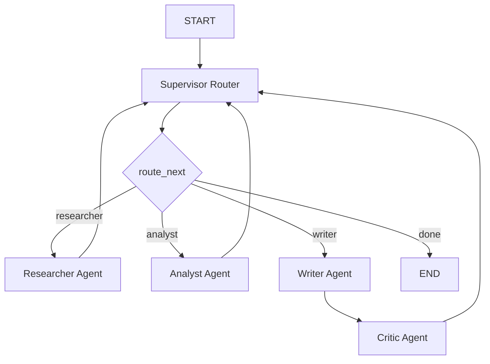

# Design Template

## Problem

Building a research assistant capable of answering complex, multi-hop user queries (e.g., explaining state-of-the-art AI architecture like GraphRAG vs. Flat RAG) with high quality, rigorous reasoning, and precise source citations.

## Why multi-agent?

Single-agent systems handle retrieval, evaluation, writing, and fact-checking in a single forward pass. This linear approach often leads to:
1. **Hallucinations**: No structured validation step.
2. **Poor Synthesis**: Retrieval and analysis are not separated, leading to shallow summaries.
3. **Weak Citations**: The single model forgets to map specific claims to source documents.
A multi-agent approach delegates tasks to specialized roles (Supervisor, Researcher, Analyst, Writer, Critic) coordinating via a shared State, enabling iterative refinement.

## Agent roles

| Agent | Responsibility | Input | Output | Failure mode |
|---|---|---|---|---|
| **Supervisor** | Orchestrates flow control, selecting the next worker based on state. | `ResearchState` | Next route name (`str`) | Infinite loop routing |
| **Researcher** | Generates queries, performs web search, and notes facts. | Query, sources | `sources`, `research_notes` | Poor query phrasing |
| **Analyst** | Evaluates raw facts, contrasts views, and lists claims. | `research_notes` | `analysis_notes` | Weak claims assessment |
| **Writer** | Compiles final report with citations for the target audience. | Notes, analysis | `final_answer` | Missing citation links |
| **Critic** | Evaluates final answer correctness and citation coverage. | `final_answer`, sources | `APPROVED` / `REJECTED` | Unjustified rejections |

## Shared state

We use `ResearchState` containing:
- `request`: The query and constraints (max sources, target audience).
- `iteration` & `route_history`: Track process loops and guard against infinite runs.
- `sources`: Shared database of unique retrieved URLs and snippets.
- `research_notes` & `analysis_notes`: Intermediate notes generated by Researcher and Analyst.
- `final_answer`: Synthesized report compiled by the Writer.
- `agent_results` & `trace`: Logs of intermediate completions and latencies.
- `errors`: Accumulated validation issues (e.g. from the Critic).

## Routing policy

## Guardrails

- **Max iterations**: Enforced in the Supervisor (`MAX_ITERATIONS` config, defaults to 6) to guarantee termination.
- **Timeout**: Enforced on web requests and LLM endpoints.
- **Retry**: Handled internally by LLM clients for network failures.
- **Fallback**: Graceful mock-search fallback and deterministic rule-based agent routing if API credentials are not provided.
- **Validation**: Performed by the Critic agent verifying that all claims reference search bibliography.

## Benchmark plan

- **Queries**:
  1. *"Explain the differences between flat RAG and GraphRAG pipelines."*
  2. *"What are the core design patterns of multi-agent systems?"*
- **Metrics**: Latency (s), Estimated Cost (USD), LLM-as-a-judge Quality Score (0-10), Citations count.
- **Expected Outcome**: Multi-Agent system achieves higher Quality Scores and rich citations, while Single-Agent Baseline yields lower latency and cost.

