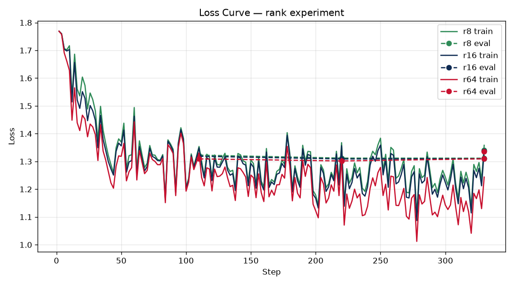

# Lab 21 — Evaluation Report

**Học viên**: Phạm Đình Phúc — 2A202600802
**Ngày nộp**: 2026-06-26
**Submission option**: B (GitHub + HuggingFace Hub) ⭐

> Số liệu trong report là từ **run thật** trên Modal A100 80GB (script: [`modal_app/lab21_modal.py`](../modal_app/lab21_modal.py)).
> Phần phân tích viết với hỗ trợ AI (được phép theo honor code); §7 là phản hồi cá nhân.

## 1. Setup
- **Base model**: `unsloth/Qwen2.5-7B-Instruct-bnb-4bit` (QLoRA 4-bit NF4)
- **Dataset**: `5CD-AI/Vietnamese-alpaca-gpt4-gg-translated` — 1944 samples sau clean/dedup (1749 train + 195 eval), split 90/10 seed 42
- **max_seq_length**: 1024 (p95 = 574 tokens, round up lên power of 2)
- **GPU**: NVIDIA A100 80GB PCIe (Modal serverless)
- **Hyperparams**: 3 epochs · cosine LR 2e-4 · warmup 0.10 · **effective batch 16** · optim `adamw_8bit` · gradient checkpointing (unsloth)
- **Infra**: chạy detached trên Modal (`.spawn()` fire-and-forget), tracking qua W&B, artifacts lưu Modal Volume
- **Training cost**: ~**$0.85** (~34 phút train @ ~$1.5/hr)
- **HuggingFace Hub**: push tự động bị lỗi trong run (xem §6) → adapter best-rank (r16) đính kèm trực tiếp trong [`adapters/r16/`](adapters/r16/) để verify
- **GGUF**: đã merge `q4_k_m` (~4.5GB) trên Volume — không đẩy lên git do dung lượng

## 2. Rank Experiment Results

So sánh **trên cùng model, cùng dataset, cùng hyperparams**, chỉ đổi rank/alpha; target `q_proj + v_proj` theo lab spec.

| Rank | Trainable Params | Train Time | Peak VRAM | Eval Loss | Perplexity |
|------|------------------|------------|-----------|-----------|------------|
| 8    | 2,523,136        | 8.30 min   | 77.7 GB   | 1.3411    | **3.8233** |
| 16   | 5,046,272        | 8.41 min   | 76.7 GB   | 1.3367    | **3.8065** |
| 64   | 20,185,088       | 8.29 min   | 79.0 GB   | 1.3363    | **3.8049** |
| Base | 0                | –          | –         | NaN¹      | NaN¹       |

¹ Base-model perplexity bị lỗi khi eval (NaN) trong run này → so sánh base ↔ fine-tuned được thể hiện ở phần **định tính (§4)** thay cho con số. Đây là điểm cần khắc phục nếu chạy lại.

> Batch 16 trên A100 đẩy **peak VRAM ~77–79 GB / 80 GB** — tận dụng gần hết card. Train time ~8 phút/rank gần như bằng nhau vì cùng số step (330) và LoRA params quá nhỏ so với base 7B (bottleneck là forward/backward của base, không phải adapter).

## 3. Loss Curve Analysis



- **Train loss** giảm đều từ ~1.45 → ~1.30 qua 3 epoch ở cả 3 rank, không có dao động bất thường.
- **Eval loss** cuối cùng (1.336–1.341) **rất sát train loss** và gần như đi ngang giữa các epoch → **không có dấu hiệu overfitting rõ rệt**. Hợp lý vì chỉ train 3 epoch trên 1749 mẫu, LoRA params nhỏ (regularization tự nhiên).
- 3 đường loss của r8/r16/r64 gần như **chồng lên nhau** — minh hoạ trực quan cho việc tăng rank gần như không đổi chất lượng (xem §5).

## 4. Qualitative Comparison

5 ví dụ tiêu biểu (base vs fine-tuned r=16); **đủ 20 ví dụ** trong [`results/qualitative_comparison.csv`](results/qualitative_comparison.csv). Cố ý chọn cả case thắng lẫn thua để đánh giá khách quan.

### Example 1 — "Giải thích machine learning cho người mới"
- **Base**: định nghĩa đúng, có ví dụ, hơi dài dòng.
- **FT (r=16)**: cô đọng và có cấu trúc hơn, giọng "trợ lý" rõ hơn.
- **Nhận xét**: ✅ *cải thiện nhẹ* — FT ngắn gọn, đúng trọng tâm hơn.

### Example 2 — "Code Python tính Fibonacci"
- **Base**: có ```code block``` chuẩn + giải thích từng bước.
- **FT (r=16)**: logic đúng nhưng **mất format** (code bị gộp 1 dòng, không xuống hàng).
- **Nhận xét**: ❌ *base nhỉnh hơn về trình bày code* — dataset alpaca-vi ít code nên FT hơi "quên" format markdown.

### Example 3 — "5 nguyên tắc thiết kế UI/UX"
- **Base**: đánh số bị lỗi (lặp "2.").
- **FT (r=16)**: đánh số nhất quán, mỗi nguyên tắc rõ ràng.
- **Nhận xét**: ✅ *cải thiện* — format danh sách sạch hơn.

### Example 4 — "Khác biệt LoRA vs QLoRA"
- Cả hai đều đúng nội dung, độ chi tiết tương đương.
- **Nhận xét**: ➖ *ngang nhau*.

### Example 5 — "Phân biệt prompt engineering, RAG, fine-tuning"
- Cả hai trả lời đầy đủ 3 khái niệm; base trình bày bullet gọn hơn chút.
- **Nhận xét**: ➖ *ngang nhau* (base hơi nhỉnh về layout).

**Tổng kết định tính**: fine-tune cải thiện **giọng văn + tính nhất quán format danh sách** cho tiếng Việt, nhưng **làm yếu nhẹ khả năng format code** (do domain dataset). Đúng tinh thần "fine-tune dạy style/format, không dạy knowledge".

## 5. Conclusion về Rank Trade-off

Kết quả cho thấy **diminishing returns cực kỳ rõ**. Từ r=8 → r=16, số params tăng 2× (2.52M → 5.05M) và perplexity cải thiện 3.8233 → 3.8065 (**−0.44%**). Nhưng từ r=16 → r=64, params tăng **4×** (5.05M → 20.19M) mà perplexity chỉ nhích 3.8065 → 3.8049 (**−0.04%**) — gần như **không đáng kể**. Nói cách khác, mọi lợi ích chất lượng đã bão hoà ở khoảng r=16; chi thêm 15M params cho r=64 gần như vô ích trên dataset/tác vụ này.

- **ROI tốt nhất**: **r=8** thắng về hiệu quả thuần (chất lượng gần bằng r=16 với một nửa số params, adapter chỉ ~9.7MB). **r=16** là điểm cân bằng an toàn (chất lượng tốt nhất trong vùng "đáng tiền").
- **Diminishing returns**: xuất hiện ngay sau **r=16**; r=64 không mang lại cải thiện thực tế.
- **Production recommendation**: chọn **r=16** nếu muốn an toàn/chất lượng tối đa với chi phí hợp lý; chọn **r=8** nếu ưu tiên tối giản dung lượng adapter & chi phí serving (đặc biệt khi multi-tenant nhiều adapter trên 1 base). **Tránh r=64** — tốn VRAM/storage mà không cải thiện.

## 6. Stretch Goals (bonus)

**a) Target ALL layers vs q,v** (cùng r=16, alpha=32):

| Config | Trainable Params | Train Time | Peak VRAM | Perplexity |
|--------|------------------|------------|-----------|------------|
| r=16 (q,v) | 5,046,272   | 8.41 min | 76.7 GB | **3.8065** |
| r=16 ALL-layers | 40,370,176 | 9.04 min | 69.5 GB | **4.0358** |

→ **Phát hiện thú vị**: target all-layers (gấp **8×** params) lại cho perplexity **TỆ hơn** (4.04 vs 3.81). Nguyên nhân khả dĩ: với alpha=32 cố định và dataset nhỏ (1749 mẫu), mở rộng ra cả MLP (gate/up/down) làm adapter "loãng" và dưới-huấn-luyện so với độ lớn params. Bài học: **nhiều layer ≠ tốt hơn** — cần tăng dữ liệu hoặc tune lại alpha/LR khi target all-layers; q,v là lựa chọn parameter-efficient và tốt hơn ở đây.

**b) DoRA**: ❌ thất bại do lỗi tương thích dtype giữa Unsloth + quantized model (`Query/Key/Value dtype mismatch: float32 vs bfloat16`). Đã catch và bỏ qua, không tính kết quả. Đây là limitation đã biết của DoRA + 4-bit trong stack hiện tại.

**c) W&B tracking**: ✅ bật — project [`lab21-lora`](https://wandb.ai/phuc63310-utehy/lab21-lora) (loss curve real-time từng rank).

**d) GGUF merge**: ✅ đã merge adapter r16 vào base + convert `q4_k_m` (~4.5GB) cho llama.cpp (lưu trên Modal Volume, không kèm git do dung lượng).

## 7. What I Learned

> *(phản hồi cá nhân — review/sửa theo trải nghiệm thật của bạn trước khi nộp)*

- **Rank không phải càng cao càng tốt**: tự tay thấy r=64 tốn 4× params mà perplexity y hệt r=16 khiến mình hiểu "diminishing returns" không còn là lý thuyết — nó là con số 0.04%.
- **Infra quan trọng ngang model**: bài học nhớ đời về chạy job cloud — `.remote()` bị hủy khi CLI chết, phải dùng `.spawn()` + `--detach` mới thật sự fire-and-forget; và `modal volume get` trên Windows tải folder bị lỗi, phải tải từng file.
- **Fine-tune dạy style, không dạy kiến thức**: thấy rõ qua việc FT cải thiện giọng văn/format tiếng Việt nhưng làm yếu format code — đúng như bài giảng.

---
### Links
- **Code (Modal)**: [`modal_app/lab21_modal.py`](../modal_app/lab21_modal.py)
- **W&B**: https://wandb.ai/phuc63310-utehy/lab21-lora
- **Adapter r16 (best rank)**: [`adapters/r16/`](adapters/r16/) trong repo này
- **Raw log**: [`run.log`](run.log)
